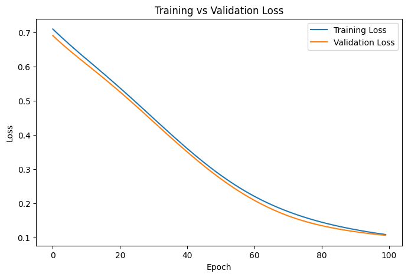

# Predicting Breast Cancer Diagnosis Using a Multi-Layer Perceptron (MLP) in PyTorch

## Project Overview

This project explores the use of a Multi-Layer Perceptron (MLP) neural network to classify breast cancer diagnoses as malignant or benign using the Breast Cancer Wisconsin Dataset.

The objective was not only to build an accurate model but also to understand:

- How neural networks learn
- How overfitting occurs
- How regularization improves generalization
- How to evaluate model performance using training and validation metrics

---

## Technologies Used

- Python
- PyTorch
- Scikit-learn
- StandardScaler
- Adam Optimizer
- CrossEntropyLoss

---

## Dataset

The project uses the Breast Cancer Wisconsin Dataset available through Scikit-learn.

The dataset contains diagnostic measurements used to classify tumors as:

- Malignant
- Benign

---

## Experiment 1: Detecting Overfitting

### Configuration

- Hidden Layer 1: 50 neurons
- Hidden Layer 2: 50 neurons
- Epochs: 500
- Learning Rate: 0.001

### Results

| Epoch | Train Loss | Validation Loss |
|---------|---------|---------|
| 100 | 0.0388 | 0.1207 |
| 200 | 0.0086 | 0.2108 |
| 300 | 0.0024 | 0.2846 |
| 400 | 0.0010 | 0.3360 |
| 500 | 0.0005 | 0.3718 |

### Observation

Training loss continued to decrease while validation loss increased.

This indicated that the model was beginning to memorize the training data instead of learning general patterns.

**Conclusion:** The model exhibited signs of overfitting.

---

## Experiment 2: Improving Generalization

### Changes Made

- Reduced hidden layers from (50,50) to (20,20)
- Reduced training epochs from 500 to 100
- Added weight decay regularization (0.01)

### Results

| Epoch | Train Loss | Validation Loss | Validation Accuracy |
|---------|---------|---------|---------|
| 100 | 0.1100 | 0.1073 | 99.03% |

### Final Test Results

- Test Loss: 0.1016
- Test Accuracy: 96.49%

### Observation

Training and validation losses remained closely aligned throughout training.

This suggested strong learning behavior and improved generalization to unseen data.

---

## Training Curve

The figure below shows the training and validation loss during the improved model experiment.

The close alignment between both curves suggests healthy learning behavior and improved generalization, indicating that the model is learning meaningful patterns without severe overfitting.

## Key Learnings

Through this project, I learned:

- How neural networks learn through forward propagation and backpropagation
- How to monitor training and validation metrics
- How to identify overfitting using loss curves
- How regularization improves generalization
- Why lower training loss does not always imply a better model

Most importantly, I learned that model evaluation should focus on generalization rather than training performance alone.

---

## Reflection

This project started as an effort to build a neural network in PyTorch.

It became an opportunity to understand how models learn, why they fail, and how they can be improved.

The most valuable lesson was not achieving high accuracy.

It was learning how to identify overfitting, interpret model behavior, and make informed improvements based on evidence.

Project completed as part of my AI Engineering learning journey.
